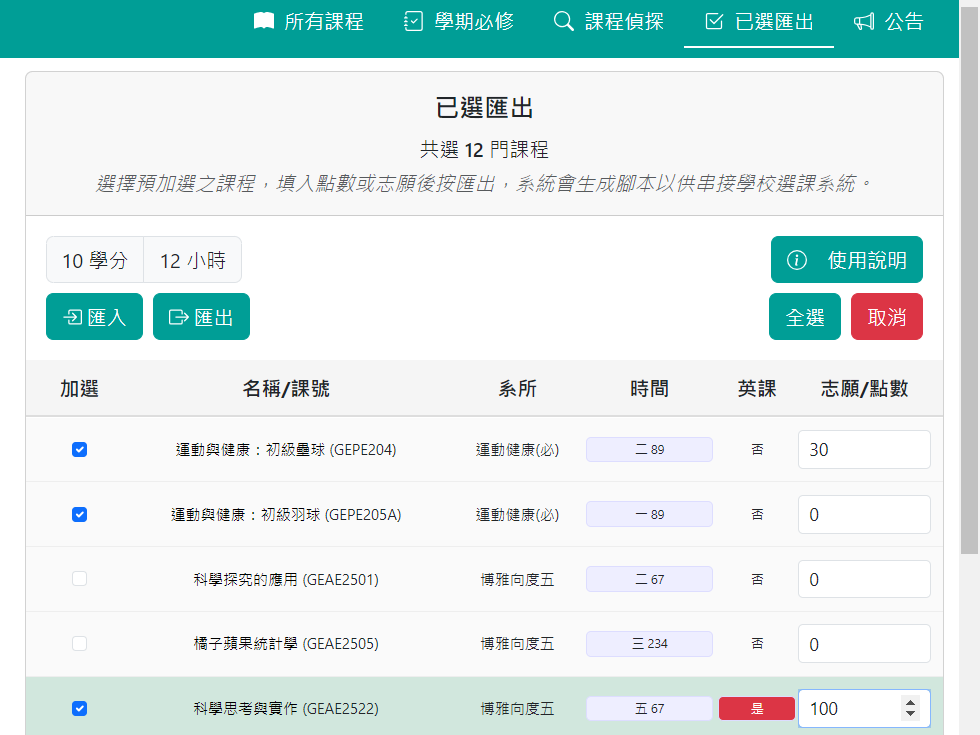
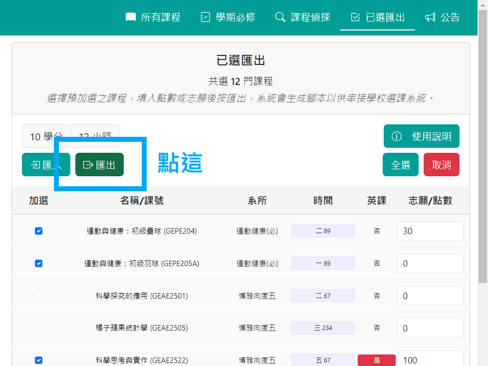
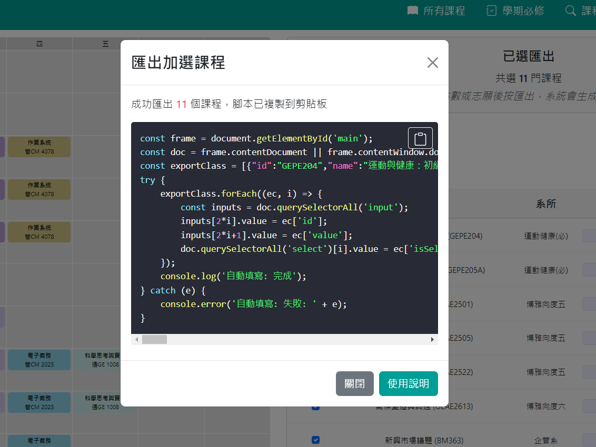

# 項目搬移

> [!WARNING]
> ⚠️ **重要提醒** ⚠️ 該項目已經搬移到新的 GitHub 倉庫，請前往新的地址查看最新的代碼和更新。
> **[https://github.com/NSYSU-OpenDev/NSYSUSelectorHelper](https://github.com/NSYSU-OpenDev/NSYSUSelectorHelper)**

## 舊有資料搬遷方式

1. 打開舊網站的已選匯出頁面，網址為 **[https://CelleryLin.github.io/selector_helper/#已選匯出](https://CelleryLin.github.io/selector_helper/#%E5%B7%B2%E9%81%B8%E5%8C%AF%E5%87%BA)**。

    

2. 點擊 `全選` 按鈕

3. 點擊 `匯出` 按鈕

    

4. 複製匯出的資料
   
   注意：匯出的資料格式為 JavaScript 腳本，請確保完整複製，你可以點選右上角的複製圖示來複製資料。

   

5. 前往新的網站， 網址為 **[https://nsysu-opendev.github.io/NSYSUSelectorHelper/#已選匯出](https://nsysu-opendev.github.io/NSYSUSelectorHelper/#%E5%B7%B2%E9%81%B8%E5%8C%AF%E5%87%BA)**。

6. 點擊 `匯入` 按鈕，並把複製的貼到輸入框中。

7. 點擊 `匯入` 按鈕，完成資料的搬移。

## 舊有資料搬遷注意事項

- 請確保你在舊網站的匯出資料是完整的，否則可能會導致搬移失敗。
- 目前僅能搬移選課資料，其他像是系所設定會需要重新設定。

## 項目狀態

當前該項目將不再更新，請前往新的 GitHub 倉庫查看最新的程式碼和更新。
本項目僅提供搬移與舊網站的資料備份，並不會再進行任何更新或維護。

感謝您對該項目的支持與使用，期待在新的 GitHub 倉庫中繼續與大家交流和分享。

---
最後更新時間：2025/04/28
